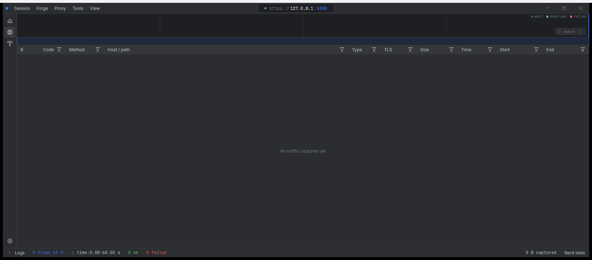
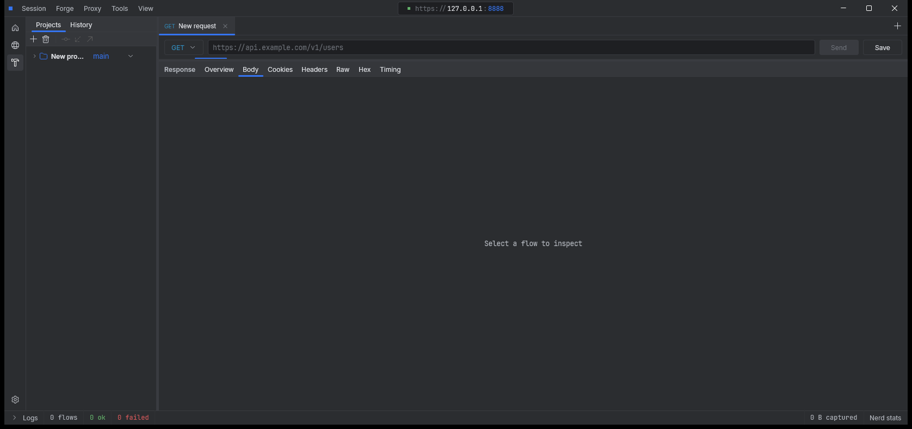
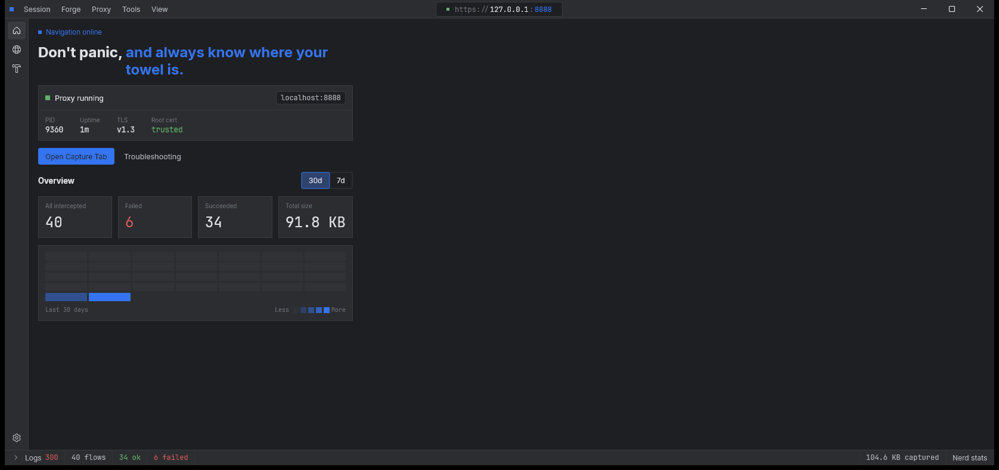

# BitTrace

An HTTP(S) capture and inspection tool for the desktop: a Compose Desktop UI in
Kotlin driving a packaged mitmproxy sidecar, plus an API client that sends
through that same proxy — so the requests you compose are captured like any
other traffic.



Every row above is real: `CONNECT` tunnels sitting beside the requests that
travel inside them, TLS versions, content kinds, and where each millisecond
went.

## What it does

### Capture

- **HTTPS interception** through a bundled mitmproxy sidecar. The certificate
  authority is generated and installed for you; the status bar says whether the
  root cert is trusted.
- **A flow table** with per-column filters — status, method, host/path, content
  type, TLS version, size, timing. Columns reflow, and the set of methods on
  offer is fixed rather than derived from what has been captured, so you can
  filter for `DELETE` before a `DELETE` has happened.
- **An overview band** where searching does not replace the timeline — it turns
  the timeline into an input. The lanes fade, the waterfall returns compressed
  at the bottom, and you brush a time window on it. A facet grid narrows by
  status, method, type, host, TLS and outcome at the same time.
- **Body search** across every captured body, decoded and debounced off the UI
  thread, with request/response sides selectable.
- **An inspector** with Overview, Body, Cookies, Headers, Raw, Hex and Timing
  views, pluggable body formatters, and a persisted split. The same pane renders
  captured flows, imported HAR entries and API client responses.
- **A waterfall and phase timeline** for where a request actually spent its
  time.
- **`CONNECT` tunnels as first-class flows.** mitmproxy answers `CONNECT`
  without raising the ordinary hooks, so a tunnel — and any refusal to open one
  — would otherwise leave no trace at all.
- **Streamed bodies.** Anything past the sidecar's threshold arrives chunk by
  chunk and is reassembled before it reaches the cache, still
  `Content-Encoding`-encoded from the wire, so it is inflated on the way in.
  Capture is best-effort by design: the sidecar drops chunks rather than
  stalling the proxy's event loop behind a slow reader, and the loss is counted
  and logged rather than hidden.
- **HAR import and export**, and a **diff tool** for comparing two flows.

### The Forge — an API client



- **Requests are YAML files on disk**, organised as projects → collections →
  requests. They diff, they travel, and they belong to the folder rather than to
  a database.
- **Project variables.** Write `{{host}}` in a URL, a header, a body or an auth
  field. Substitution happens at send time and is never written back, so the
  saved file describes an endpoint rather than one machine's idea of it.
- **Auth**: OAuth 2 with a loopback redirect listener, OAuth 1, JWT assertion
  grants, bearer tokens, basic auth and API keys.
- **Git, built in.** Projects are repositories: branch, stage and commit through
  a file picker, push, pull, and read a request's history from git itself rather
  than from a log the app keeps. JGit, not a shelled-out `git`, so it works on a
  machine with no git installed. SSH uses the keys and agent already on your
  machine; HTTPS uses a token from Settings.
- **Import from cURL**, convert a captured flow into a request, and export a
  collection as a zip.
- **Send history**, per-request settings, and an unsaved-changes guard that
  stops a checkout overwriting work in progress.

### Home



Proxy status, session counters, and a thirty-day activity heatmap. It also
greets you, and it does not take itself seriously about it — one of ten lines,
picked at random and held for as long as you stay on the screen:

> Don't panic, **and always know where your towel is.**
> May the packets be with you, **always.**
> Live long and **inspect traffic.**
> It's dangerous to go alone, **take this proxy.**
> You are the one, **Neo of the network.**
> Winter is coming, **so is the timeout.**
> One does not simply **walk into production.**
> Roads? Where we're going **we need no roads.**
> So say we all, **and so say the sockets.**
> Welcome back, **traveler.**

They live in `Greetings` in
[`ui/layouts/home/Home.kt`](src/main/kotlin/ui/layouts/home/Home.kt). Adding one
is a one-line pull request, and the bar for entry is low.

### Plugins

`:plugin-api` is a separate module with almost nothing in it — no serialization
dependency, no knowledge of the app's models — so a plugin never compiles
against internals that are free to change. It offers:

- **Themes**, as a full palette with colour ramps.
- **Body formatters**, for rendering a content type in the inspector.
- **Collection and flow actions**, which appear in the context menus.

External plugins load as JARs through `ServiceLoader`.

## Running it

Requires a JDK 25 toolchain. Gradle will fetch one if you don't have it.

```bash
./gradlew run
```

Tests:

```bash
./gradlew test
```

## Packaging

Installers need a **JetBrains Runtime with `jmods`** — the window chrome depends
on JBR, and `jlink` needs the module files to build a runtime image. IDE-bundled
JBRs are `-nomod` builds and will not work; download a `jbrsdk` build from the
[JetBrainsRuntime releases](https://github.com/JetBrains/JetBrainsRuntime/releases).

```bash
./gradlew dist -PjbrHome=<path-to-jbrsdk>
```

That builds everything a release ships and puts it in `build/dist`:

| File | For |
| --- | --- |
| `BitTrace-<version>.exe` | The setup wizard — asks where to install, makes the Start-menu entry and desktop shortcut |
| `BitTrace-<version>.msi` | The same install for `msiexec /qn` and group policy; upgrades a prior install in place |
| `BitTrace-<version>-portable.zip` | No installer, no registry, no admin rights — unzip and run |

Windows only: jpackage builds installers for the host OS and nothing else. The
individual `packageReleaseExe`, `packageReleaseMsi` and
`createReleaseDistributable` tasks are still there if you want one artifact.

## Layout

| Path | What's in it |
| --- | --- |
| `src/main/kotlin/proxy/` | The sidecar: process, frame protocol, body cache, CA handling |
| `src/main/kotlin/data/` | Wire models and stores |
| `src/main/kotlin/api/` | Request model, collections, sending, importers, OAuth |
| `src/main/kotlin/git/` | Version control for projects, over JGit |
| `src/main/kotlin/session/` | HAR import and export |
| `src/main/kotlin/ui/components/` | The shared widget vocabulary |
| `src/main/kotlin/ui/layouts/<screen>/` | One screen each, with its own private parts beside it |
| `plugin-api/` | The public plugin contract |

A composable used by more than one screen lives in `ui/components/`; one only
its own screen will ever want lives in that screen's own `components/`. The
folder draws the line, so where something belongs is not a matter of taste.

[ARCHITECTURE.md](ARCHITECTURE.md) covers the reasoning — where the seams fall
and why.
